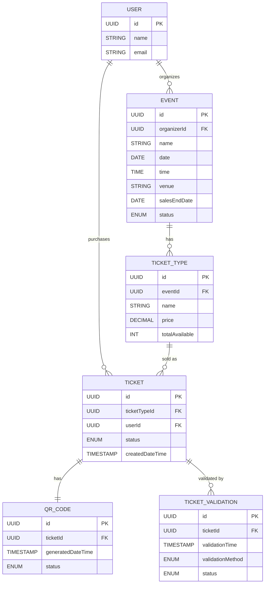
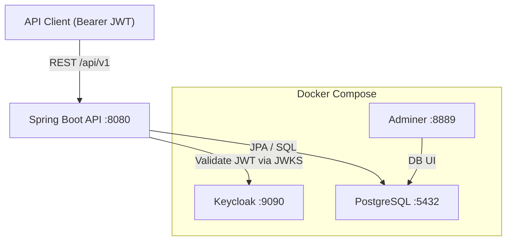
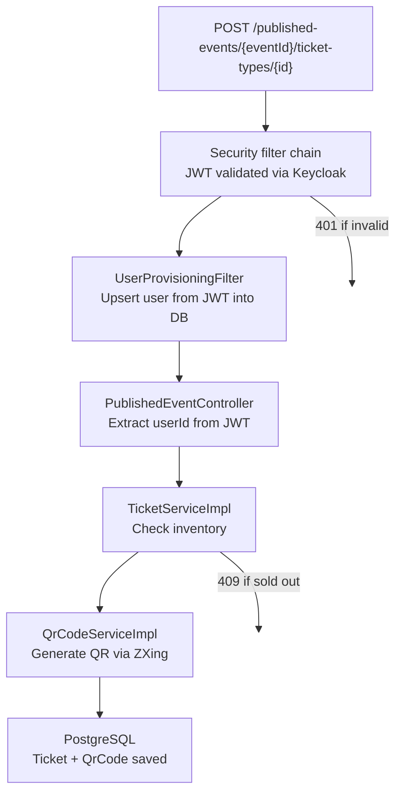
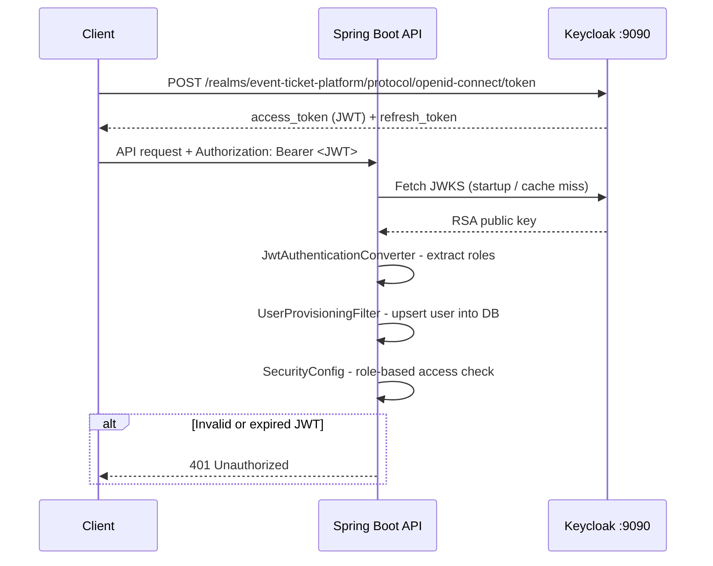

# Event Ticket Platform - V1

A full-lifecycle event ticketing backend built with **Spring Boot 4**, **PostgreSQL**, and **Keycloak**. This is the first iteration of the platform, covering system design, domain modelling, REST API design, and the complete backend implementation.

---

## Table of Contents

- [Overview](#overview)
- [Features](#features)
- [Tech Stack](#tech-stack)
- [Project Structure](#project-structure)
- [Domain Model](#domain-model)
- [REST API](#rest-api)
- [Diagrams](#diagrams)
- [Infrastructure](#infrastructure)
- [Getting Started](#getting-started)
- [Configuration](#configuration)

---

## Overview

The Event Ticket Platform manages the complete event lifecycle from an organizer creating an event and defining ticket tiers, through attendees purchasing tickets and receiving QR codes, to staff scanning and validating those tickets at the venue entrance.

The system serves three user types:

- **Organizers** : create and manage events, define ticket types and pricing, monitor ticket sales
- **Attendees** : browse published events, purchase tickets, access their digital QR code tickets
- **Staff** : validate tickets at entry points via QR code scanning, with fallback manual entry

---

## Features

### Authentication & Authorization
- Keycloak-based OAuth2/OIDC authentication
- JWT-based stateless security via Spring Security OAuth2 Resource Server
- Custom `JwtAuthenticationConverter` for role extraction from Keycloak tokens
- `UserProvisioningFilter` - automatically provisions users from JWT into the local database on first access

### Event Management
- Full CRUD for events (create, list, retrieve, update, delete)
- Organizer-scoped access - organizers only see and manage their own events
- Paginated event listing via Spring Data `Pageable`
- Event status tracking via `EventStatusEnum`
- Multiple ticket types per event with individual pricing and quantity limits

### Ticket Types
- Create, retrieve, update, and delete ticket types per event
- Quantity cap enforcement per ticket type

### Ticket Sales & Purchase
- Attendee-facing published events listing and detail retrieval
- Ticket purchase endpoint with real-time inventory management
- `TicketsSoldOutException` thrown when a ticket type is exhausted
- Ticket status tracked via `TicketStatusEnum`
- Paginated ticket listing for authenticated attendees

### QR Code Generation
- QR codes generated automatically on ticket purchase using **Google ZXing**
- `QrCodeConfig` for centralised QR generation settings
- QR code status tracked via `QrCodeStatusEnum` (valid / used / cancelled)
- Dedicated endpoint to retrieve the QR code for a given ticket

### Ticket Validation
- Staff endpoint to submit a ticket validation at event entry
- Validation records: timestamp, method (`TicketValidationMethod`), and result status (`TicketValidationStatusEnum`)
- Duplicate ticket use prevention via status checks
- Full validation history retrievable per event

### Error Handling
- Global exception handler via `GlobalExceptionHandler`
- Custom typed exceptions for every failure case:
    - `EventNotFoundException`, `EventUpdateException`
    - `TicketNotFoundException`, `TicketTypeNotFoundException`, `TicketsSoldOutException`
    - `QrCodeNotFoundException`, `QrCodeGenerationException`
    - `UserNotFoundException`
- Structured `ErrorDto` responses

### Data & Validation
- Bean Validation (`spring-boot-starter-validation`) on all request DTOs
- `orm.xml` for additional JPA mapping configuration
- Hibernate auto DDL (`update` mode) — schema kept in sync with entities
- UTC timezone enforced across JPA and test runner

---

## Tech Stack

| Layer | Technology | Version |
|---|---|---|
| Language | Java | 21 |
| Framework | Spring Boot | 4.0.2 |
| Security | Spring Security + OAuth2 Resource Server | — |
| Auth Server | Keycloak | latest |
| Database | PostgreSQL | latest |
| ORM | Spring Data JPA / Hibernate | — |
| Object Mapping | MapStruct | 1.6.3 |
| QR Code Generation | Google ZXing (`core` + `javase`) | 3.5.1 |
| Build Tool | Apache Maven | — |
| Containerization | Docker Compose | — |
| Test Database | H2 (in-memory) | — |
| Boilerplate Reduction | Lombok | 1.18.36 |

---

## Project Structure

```
src/main/java/com/spring_project/Event_Ticket_Platform/
├── config/
│   ├── JpaConfiguration.java               # JPA config
│   ├── JwtAuthenticationConverter.java     # Keycloak role extraction from JWT
│   ├── QrCodeConfig.java                   # ZXing QR code settings
│   └── SecurityConfig.java                 # Spring Security filter chain
├── controllers/
│   ├── EventController.java                # /api/v1/events
│   ├── PublishedEventController.java       # /api/v1/published-events
│   ├── TicketController.java               # /api/v1/tickets
│   ├── TicketTypeController.java           # /api/v1/events/{id}/ticket-types
│   ├── TicketValidationController.java     # /api/v1/events/{id}/ticket-validations
│   └── GlobalExceptionHandler.java         # Centralised error handling
├── domain/
│   ├── dtos/                               # Request & response DTOs (22 classes)
│   ├── entities/                           # JPA entities: Event, Ticket, TicketType, QrCode, TicketValidation, User
│   ├── enums/                              # EventStatusEnum, QrCodeStatusEnum, TicketStatusEnum, TicketValidationMethod, TicketValidationStatusEnum
│   ├── CreateEventRequest.java
│   ├── UpdateEventRequest.java
│   ├── CreateTicketTypeRequest.java
│   └── UpdateTicketTypeRequest.java
├── exceptions/                             # 9 typed exception classes
├── filters/
│   └── UserProvisioningFilter.java         # Auto-provisions JWT users into local DB
├── mappers/
│   ├── EventMapper.java                    # MapStruct mapper
│   ├── TicketMapper.java
│   └── TicketValidationMapper.java
├── repositories/                           # Spring Data JPA repositories (6)
├── services/
│   ├── EventService.java                   # Service interfaces
│   ├── QrCodeService.java
│   ├── TicketService.java
│   ├── TicketTypeService.java
│   ├── TicketValidationService.java
│   └── impl/                               # Service implementations (5)
├── util/
│   └── JwtUtil.java                        # JWT parsing helpers (e.g. parseUserId)
└── EventTicketPlatformApplication.java
```

---

## Domain Model

| Entity | Key Fields |
|---|---|
| `Event` | `id`, `name`, `date`, `time`, `venue`, `salesEndDate`, `status` |
| `TicketType` | `id`, `name`, `price`, `totalAvailable` |
| `Ticket` | `id`, `status` (`TicketStatusEnum`), `createdDateTime` |
| `QrCode` | `id`, `generatedDateTime`, `status` (`QrCodeStatusEnum`) |
| `User` | `id`, `name`, `email` |
| `TicketValidation` | `id`, `validationTime`, `validationMethod`, `status` |

**Relationships:**
- `Event` → many `TicketType`s
- `TicketType` → many `Ticket`s
- `Ticket` → one `QrCode`
- `Ticket` → many `TicketValidation`s
- `User` (Organizer) → many `Event`s

---

## REST API

All endpoints are versioned under `/api/v1`. All requests require a valid Keycloak JWT in the `Authorization: Bearer <token>` header.

### Events — Organizer

| Method | Endpoint | Description |
|---|---|---|
| `POST` | `/api/v1/events` | Create a new event |
| `GET` | `/api/v1/events` | List organizer's events (paginated) |
| `GET` | `/api/v1/events/{eventId}` | Get event details |
| `PUT` | `/api/v1/events/{eventId}` | Update an event |
| `DELETE` | `/api/v1/events/{eventId}` | Delete an event |

### Ticket Types — Organizer

| Method | Endpoint | Description |
|---|---|---|
| `POST` | `/api/v1/events/{eventId}/ticket-types` | Create a ticket type |
| `GET` | `/api/v1/events/{eventId}/ticket-types` | List ticket types for an event |
| `GET` | `/api/v1/events/{eventId}/ticket-types/{ticketTypeId}` | Get ticket type details |
| `PUT` | `/api/v1/events/{eventId}/ticket-types/{ticketTypeId}` | Update a ticket type |
| `DELETE` | `/api/v1/events/{eventId}/ticket-types/{ticketTypeId}` | Delete a ticket type |

### Published Events — Attendee

| Method | Endpoint | Description |
|---|---|---|
| `GET` | `/api/v1/published-events` | Browse published events (paginated) |
| `GET` | `/api/v1/published-events/{eventId}` | Get published event details |
| `POST` | `/api/v1/published-events/{eventId}/ticket-types/{ticketTypeId}` | Purchase a ticket |

### Tickets — Attendee

| Method | Endpoint | Description |
|---|---|---|
| `GET` | `/api/v1/tickets` | List authenticated user's tickets (paginated) |
| `GET` | `/api/v1/tickets/{ticketId}` | Get ticket details |
| `GET` | `/api/v1/tickets/{ticketId}/qr-codes` | Get QR code for a ticket |

### Ticket Validation — Staff

| Method | Endpoint | Description |
|---|---|---|
| `POST` | `/api/v1/events/{eventId}/ticket-validations` | Submit a ticket validation |
| `GET` | `/api/v1/events/{eventId}/ticket-validations` | List validations for an event |
---

## Diagrams

### ER / Schema Diagram



### System Architecture



### Ticket Purchase Flow



### Auth Flow



---

## Infrastructure

Docker Compose spins up all required services on a shared `app-network` bridge network.

| Service | Image | Host Port | Description |
|---|---|---|---|
| `db` | `postgres:latest` | `5432` | PostgreSQL database |
| `adminer` | `adminer:latest` | `8889` | Database UI (`http://localhost:8889`) |
| `keycloak` | `keycloak:latest` | `9090` | Auth server (`http://localhost:9090`) |

Keycloak data is persisted via a named Docker volume (`keycloak-data`). The Spring Boot app connects directly to `localhost` — it runs outside Docker Compose.

---

## Getting Started

### Prerequisites

- Java 21
- Docker & Docker Compose
- Maven

### 1. Set Up Environment Variables

Copy the example env file and fill in your values:

```bash
cp .env.example .env
```

`.env.example`:
```env
DB_PASSWORD=your_db_password
KEYCLOAK_ADMIN_PASSWORD=your_keycloak_admin_password
```

> `.env` is gitignored and should never be committed.

### 2. Start Infrastructure

```bash
docker compose up -d
```

### 3. Configure Keycloak

1. Open `http://localhost:9090` and log in with the admin credentials from your `.env`
2. Create a new realm named `event-ticket-platform`
3. Create a client for the backend application
4. Create roles: `ORGANIZER`, `ATTENDEE`, `STAFF`
5. Assign roles to users as needed

### 4. Run the Application

```bash
./mvnw spring-boot:run
```

The API will be available at `http://localhost:8080/api/v1`.

### 5. Access Adminer (Database UI)

Open `http://localhost:8889` and log in with:

| Field | Value |
|---|---|
| System | PostgreSQL |
| Server | `db` |
| Username | `postgres` |
| Password | *(your `DB_PASSWORD` from `.env`)* |
| Database | `postgres` |

### 6. Run Tests

```bash
./mvnw test
```

Tests use an H2 in-memory database and run independently of Docker. UTC timezone is enforced via the Surefire plugin configuration.

---

## Configuration

`src/main/resources/application.properties`:

```properties
spring.application.name=Event_Ticket_Platform

# Database
spring.datasource.url=jdbc:postgresql://localhost:5432/postgres
spring.datasource.username=postgres
spring.datasource.password=${DB_PASSWORD}

# JPA
spring.jpa.hibernate.ddl-auto=update
spring.jpa.show-sql=true
spring.jpa.properties.hibernate.format_sql=true
spring.jpa.properties.hibernate.dialect=org.hibernate.dialect.PostgreSQLDialect
spring.jpa.properties.hibernate.jdbc.time_zone=UTC

# Keycloak / OAuth2
spring.security.oauth2.resourceserver.jwt.issuer-uri=http://localhost:9090/realms/event-ticket-platform
```

`docker-compose.yml` picks up variables from `.env` automatically. Make sure your `POSTGRES_PASSWORD` and `KEYCLOAK_ADMIN_PASSWORD` entries in `docker-compose.yml` reference `${DB_PASSWORD}` and `${KEYCLOAK_ADMIN_PASSWORD}` respectively.

Also add the following to `.gitignore` if not already present:

```
.env
```